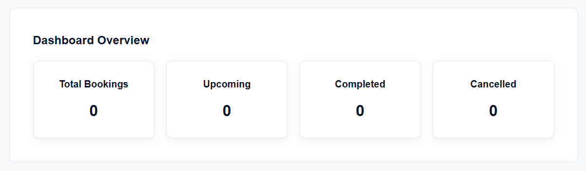
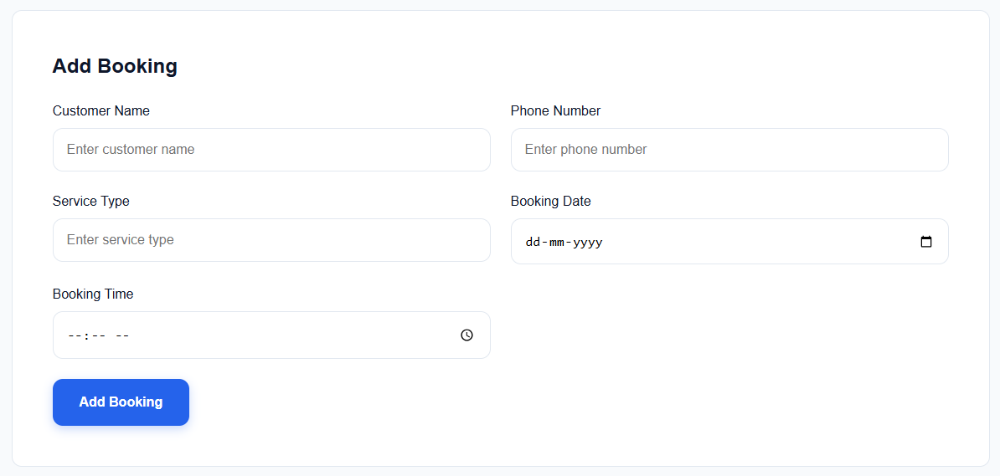
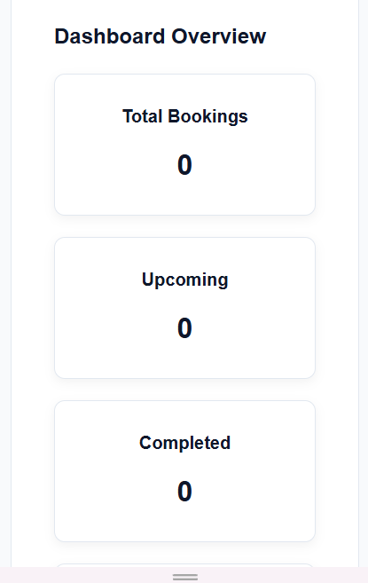
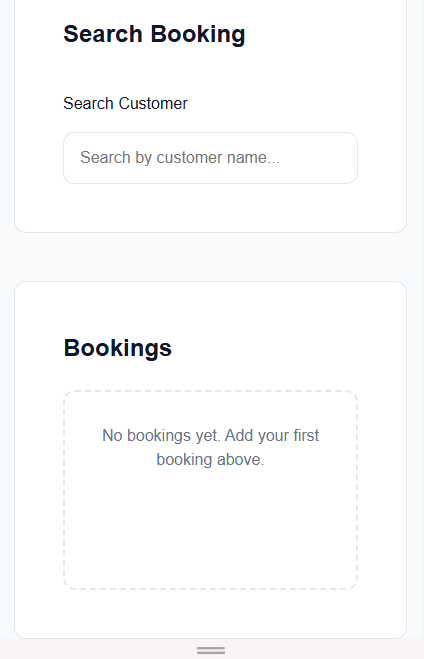

# 📅 Local Service Booking Dashboard

A responsive frontend booking management application built with **HTML, CSS, and JavaScript** that helps small businesses manage appointments and customer bookings efficiently.

The application allows users to create, edit, delete, search, and manage bookings while automatically updating booking statistics and persisting data using the browser's Local Storage API.

---

## 🚀 Live Demo

**Website:** Add your GitHub Pages link here

https://jiya-arya.github.io/booking-dashboard/

---

## 📸 Screenshots

### Dashboard



### Booking Form



### Mobile View




---

## ✨ Features

* ✅ Add new bookings
* ✅ Edit existing bookings
* ✅ Delete bookings with confirmation
* ✅ Real-time customer search
* ✅ Booking status management

  * Upcoming
  * Completed
  * Cancelled
* ✅ Live dashboard statistics
* ✅ Form validation
* ✅ Local Storage persistence
* ✅ Responsive design
* ✅ Date and time formatting

---

## 📋 Booking Information

Each booking contains:

* Customer Name
* Phone Number
* Service Type
* Booking Date
* Booking Time
* Booking Status

---

## 📊 Dashboard Statistics

The application automatically tracks:

* Total Bookings
* Upcoming Bookings
* Completed Bookings
* Cancelled Bookings

---

## 🛠️ Tech Stack

* HTML5
* CSS3
* JavaScript (ES6)
* Local Storage API
* Git & GitHub

---

## 🧠 Concepts Practiced

### JavaScript

* DOM Manipulation
* Event Handling
* CRUD Operations
* State Management
* Dynamic Rendering
* Form Validation
* Local Storage
* Date & Time Formatting
* Search and Filtering
* Array Methods

  * forEach()
  * find()
  * filter()
  * map()

### CSS

* Flexbox
* Grid
* Responsive Design
* CSS Variables
* Component-Based Styling

### HTML

* Semantic HTML
* Forms
* Accessibility Attributes
* Structured Layout

---

## 📁 Project Structure

```text
booking-dashboard/
│
├── index.html
├── style.css
├── script.js
├── README.md
└── documentation.docx
```

---

## ⚙️ Installation

Clone the repository:

```bash
git clone https://github.com/your-username/booking-dashboard.git
```

Open:

```text
index.html
```

in your browser.

---

## 🎯 Project Goal

This project was built as a real-world problem-solving application to practice:

* Building complete CRUD applications
* Managing frontend application state
* Creating dynamic user interfaces
* Working with browser storage
* Organizing and refactoring JavaScript code

---

## 🔮 Future Improvements

* Dark Mode
* Booking Categories
* Sorting & Filters
* Export to CSV
* Calendar View
* Backend Integration
* Authentication System

---

## 👩‍💻 Author

**Jiya Arya**

Frontend Developer in Progress 🚀

Building projects and learning modern web development one project at a time.
